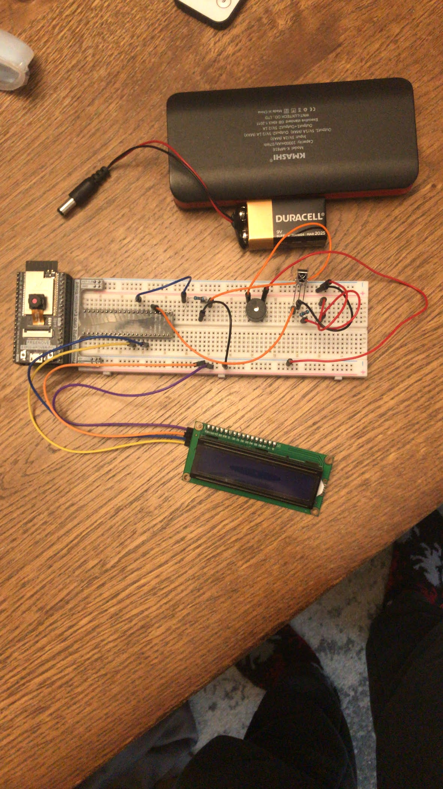
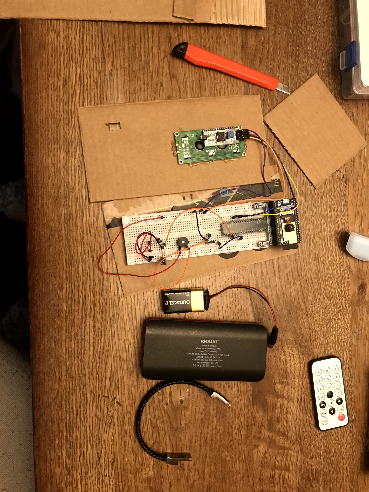
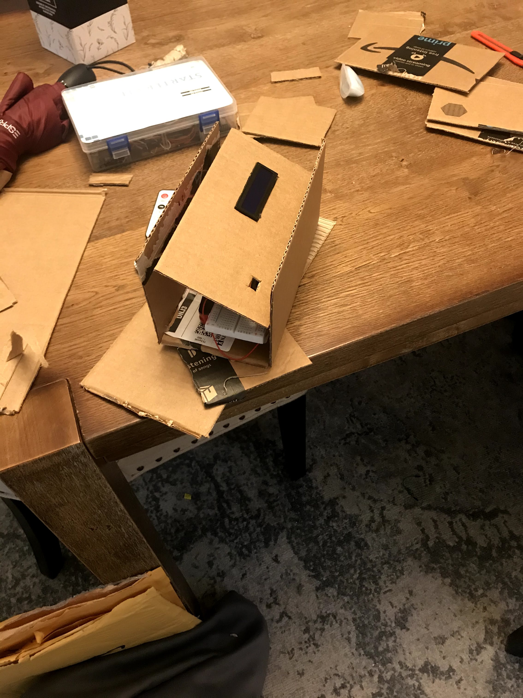
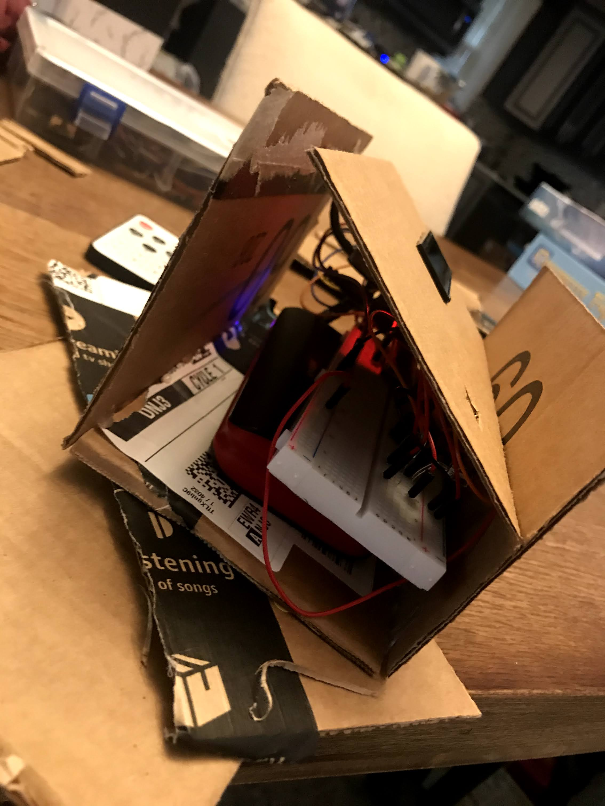
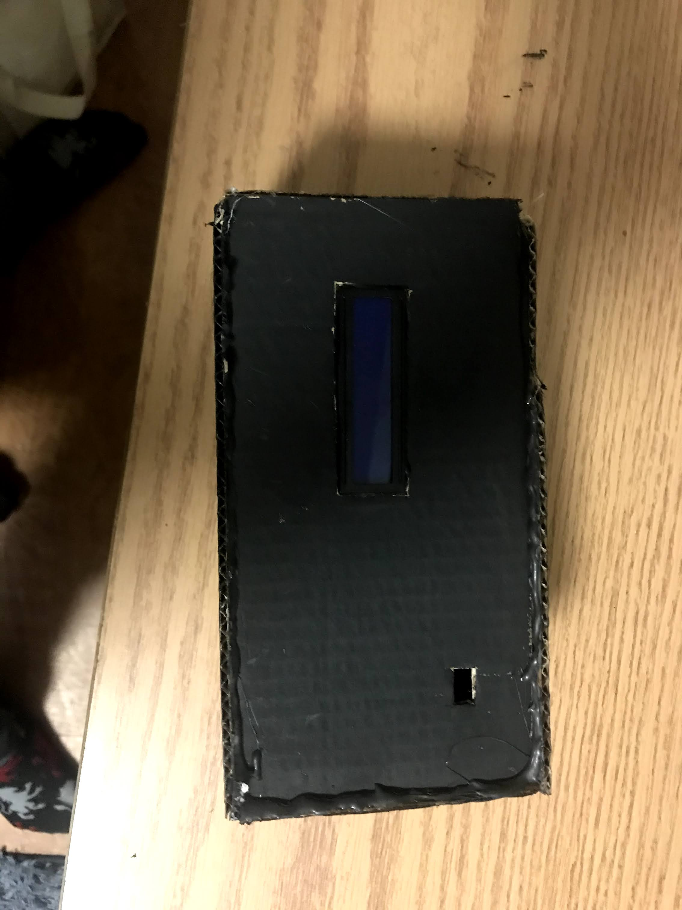
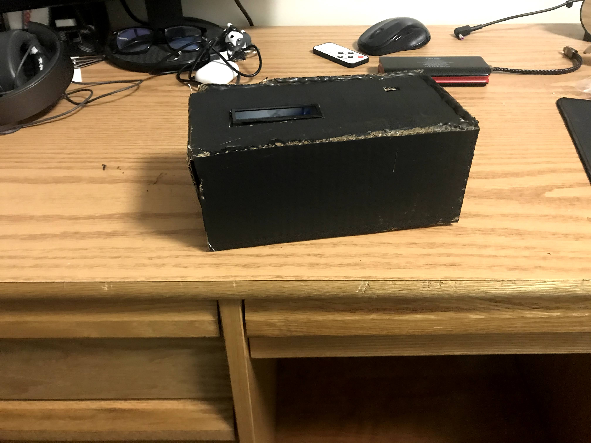

# Alarming Morning

This repository contains arduino code that is used to activate a simple alarm clock. It's a lot of fun. 

[Video Demo](https://youtu.be/zq7OPps-yXg)
[Explanation One](https://youtu.be/eG1zyk9zbWw)
[Explanation Two](https://youtu.be/c28FHbqmylg)

# Table of Contents <!-- omit in toc -->
- [Setup](#setup)
  - [Hardware](#hardware)
  - [Software](#software)
  - [Enclosure](#enclosure)
  - [Getting Started](#running)  

# Setup

## Hardware

This program is rather simple. It requires an esp32 wrover module with an attached Infrared remote sensor, buzzer, and lcd screen. A power source is necessary, but an additional 9v battery are also recommended but not required. 

1. Infrared remote sensor: 
    * Connect the rightmost pin to the 3.3v pin on the GPIO extension board. 
    * Connect the center pin to the GND pin on the GPIO extension  board. 
    * Connect the leftmost pin to pin 15 on the GPIO extension board
2. Buzzer
    * Connect the left pin to a 220kΩ resistor, and then to pin 4 on the GPIO extension board
    * Connect the other pin to the 5v power supply

3. LCD Screen
    * Connect the GND pin to the GND pin on the GPIO extension  board. 
    * Connect the VCC pin to the 5v pin on the GPIO extension board. 
    * Connect the SDA pin to the 13 pin on the GPIO extension board.
    * Connect the SDL pin to the 14 pin on the GPIO extension board.

## Software 

The Arduino code, which is to be run on the esp32. It is contained within the alarmBrain folder. The first thing that happens is the LCD activates and the infrared reciever prepares to look for incoming signals from the remote. The buzzer is also prepared to emit sound, and the esp32 system timer begins counting how long it's been awake for. There is a list of predetermined math problems, and when the alarm is active one of them is chosen, and it is displayed on the lcd screen. It's usually a simple math problem, all of which have a one digit correct response. 
If the user answers correctly, the alarm stops sounding and the LCD screen turns off. If the user answers incorrectly instead, the math problem changes.
Occasionally, the user is offered a free question to let them off without having to try too hard in the morning, but then there is another "free" question that is a lie, intended to frustrate the user in order to help them wake up. 

Before attempting to run this software, be sure to install the LiquidCrystal I2C and IRremoteESP8266 libraries, otherwise the infrared sensor and LCD screen will not work. 

## Enclosure 

The enclosure is a pure black box with a small latch on the side to allow acess to the internal workings. On the top, there is an LCD screen facing outwards, and a small hole through which one must aim the infrared remote. The goal of this box? Frustration. 

As a black box, it's intended to blend in with a room that is cloaked in darkness during the night, alowing the user to forget about its presence as they fall asleep, until the fateful hour at which it awakens, LCD screen flaring on and illuminating the room. It wakes up its intended user, and frantically they try to answer the now visible math problem, upset that they have to answer a math question to shut off this annoyingly loud buzzer. They go to answer the question with the remote, but the lack of securely fastened hardware on the inside of the box makes it difficult for them to aim the remote at the sensor, and they slowly grow more and more frustrated until at last, they are awake, and the alarm has stopped.... for now. 

## Getting Started

First, you must load the alarmBrain script onto the esp32 module. This can be done by opening the Arduino program, compiling and uploading the code to the arduino, and being sure to hold down the boot button while this is occuring. Afterwards, follow the instructions listed above in the hardware section to determine how to plug in the various input devices. 